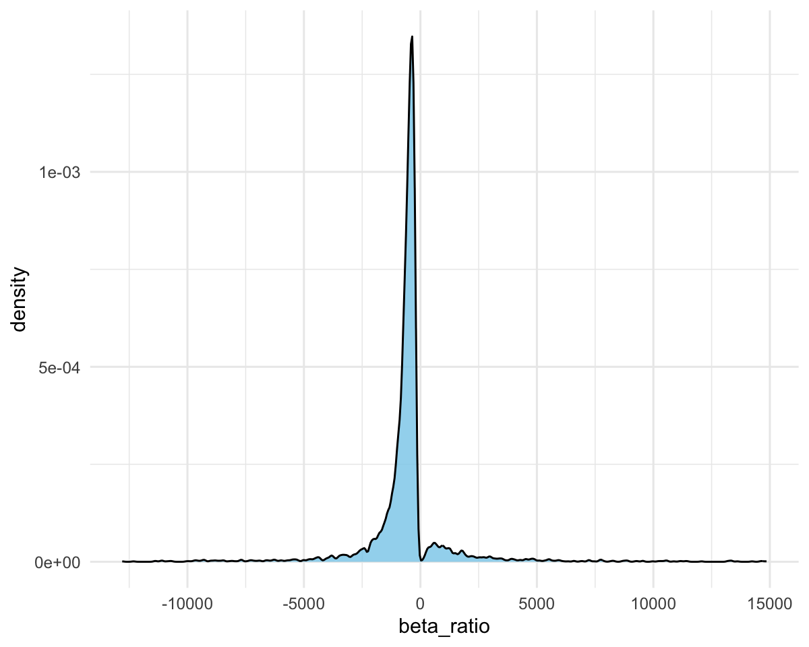
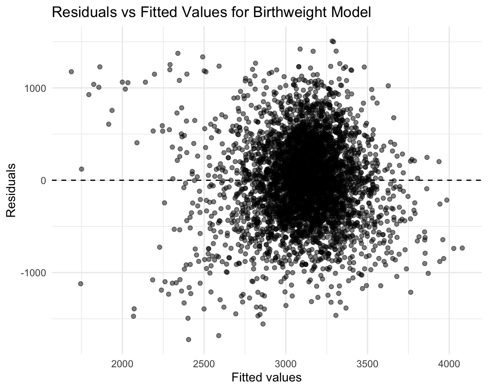

p8105_hw6_xh2601
================

``` r
# load the tidyverse library
library(tidyverse)
library(modelr)
```

The general format for plots making

``` r
knitr::opts_chunk$set(
  fig.width = 6,
  fig.asp = .8,
  out.width = "90%",
  dpi = 200
)

theme_set(
  theme_minimal() + 
    theme(legend.position = "bottom",
          plot.title = element_text(hjust = 0.5))
)

options(
  ggplot2.continuous.colour = "viridis",
  ggplot2.continuous.fill = "viridis"
)

scale_colour_discrete = scale_colour_viridis_d
scale_fill_discrete = scale_fill_viridis_d
```

## Problem 1

1.  Create a city_state variable (e.g. “Baltimore, MD”), and a binary
    variable indicating whether the homicide is solved. Omit cities
    Dallas, TX; Phoenix, AZ; and Kansas City, MO – these don’t report
    victim race. Also omit Tulsa, AL – this is a data entry mistake. For
    this problem, limit your analysis those for whom victim_race is
    white or black. Be sure that victim_age is numeric.

``` r
# import the dataset
# use mutate() to create the city_state variable
# use mutate() to create a variable to indicate whether the case is unsolved
# use mutate() to make sure victim_age is numeric
# use filter() remove the unwanted rows
homicide_df = read_csv("data/homicide-data.csv") |> 
  janitor::clean_names() |> 
  mutate(
    city_state = str_c(city, ", ", state),
    solved = (!disposition %in% c("Closed without arrest", "Open/No arrest")),
    victim_age = as.numeric(victim_age)
  ) |> 
  filter(
    !city_state %in% c("Dallas, TX", "Phoenix, AZ", "Kansas City, MO", "Tulsa, AL"),
    victim_race %in% c("White", "Black")
  )
```

    ## Rows: 52179 Columns: 12
    ## ── Column specification ────────────────────────────────────────────────────────
    ## Delimiter: ","
    ## chr (9): uid, victim_last, victim_first, victim_race, victim_age, victim_sex...
    ## dbl (3): reported_date, lat, lon
    ## 
    ## ℹ Use `spec()` to retrieve the full column specification for this data.
    ## ℹ Specify the column types or set `show_col_types = FALSE` to quiet this message.

    ## Warning: There was 1 warning in `mutate()`.
    ## ℹ In argument: `victim_age = as.numeric(victim_age)`.
    ## Caused by warning:
    ## ! NAs introduced by coercion

2.  For the city of Baltimore, MD, use the glm function to fit a
    logistic regression with resolved vs unresolved as the outcome and
    victim age, sex and race as predictors. Save the output of glm as an
    R object; apply the broom::tidy to this object; and obtain the
    estimate and confidence interval of the adjusted odds ratio for
    solving homicides comparing male victims to female victims keeping
    all other variables fixed.

``` r
# create a df for baltimore
# select variables of interest
baltimore_df = homicide_df |> 
  filter(city_state == "Baltimore, MD") |> 
  select(uid, victim_race, victim_age, victim_sex, solved)

# fit glm logistic model 
# apply broom::tidy() and exponentiate the estimate
baltimore_logit = 
  glm(
    solved ~ victim_race + victim_age + victim_sex,
    data = baltimore_df,
    family = binomial(link = "logit")) |> 
  broom::tidy(
    exponentiate = TRUE,
    conf.int = TRUE)

# get odds ration estimate and CI
baltimore_logit |> 
  filter(term == "victim_sexMale") |> 
  select(term, estimate, conf.low, conf.high) |> 
  knitr::kable()
```

| term           |  estimate |  conf.low | conf.high |
|:---------------|----------:|----------:|----------:|
| victim_sexMale | 0.4255117 | 0.3241908 | 0.5575508 |

3.  Now run glm for each of the cities in your dataset, and extract the
    adjusted odds ratio (and CI) for solving homicides comparing male
    victims to female victims. Do this within a “tidy” pipeline, making
    use of purrr::map, list columns, and unnest as necessary to create a
    dataframe with estimated ORs and CIs for each city.

``` r
# create a function to fit logistic regression for each city
homicide_sex_logit = function(df){
  glm(
    solved ~ victim_race + victim_age + victim_sex,
    data = df,
    family = binomial(link = "logit")) |> 
  broom::tidy(
    exponentiate = TRUE,
    conf.int = TRUE) |> 
  filter(term == "victim_sexMale") |> 
  select(term, estimate, conf.low, conf.high)
}
```

``` r
# select the variables of interest, nest on city_state
# map on the homicide_sex_logit() function for each nested dataframe
# unnest the result
homicide_sex = homicide_df |> 
  select(uid, city_state, victim_race, victim_age, victim_sex, solved) |> 
  nest(data = -city_state) |> 
  mutate(
    results = map(data, homicide_sex_logit)
  ) |> 
  select(-data) |> 
  unnest()
```

    ## Warning: There were 43 warnings in `mutate()`.
    ## The first warning was:
    ## ℹ In argument: `results = map(data, homicide_sex_logit)`.
    ## Caused by warning:
    ## ! glm.fit: fitted probabilities numerically 0 or 1 occurred
    ## ℹ Run `dplyr::last_dplyr_warnings()` to see the 42 remaining warnings.

    ## Warning: `cols` is now required when using `unnest()`.
    ## ℹ Please use `cols = c(results)`.

``` r
homicide_sex
```

    ## # A tibble: 47 × 5
    ##    city_state      term           estimate conf.low conf.high
    ##    <chr>           <chr>             <dbl>    <dbl>     <dbl>
    ##  1 Albuquerque, NM victim_sexMale    1.77     0.825     3.76 
    ##  2 Atlanta, GA     victim_sexMale    1.00     0.680     1.46 
    ##  3 Baltimore, MD   victim_sexMale    0.426    0.324     0.558
    ##  4 Baton Rouge, LA victim_sexMale    0.381    0.204     0.684
    ##  5 Birmingham, AL  victim_sexMale    0.870    0.571     1.31 
    ##  6 Boston, MA      victim_sexMale    0.674    0.353     1.28 
    ##  7 Buffalo, NY     victim_sexMale    0.521    0.288     0.936
    ##  8 Charlotte, NC   victim_sexMale    0.884    0.551     1.39 
    ##  9 Chicago, IL     victim_sexMale    0.410    0.336     0.501
    ## 10 Cincinnati, OH  victim_sexMale    0.400    0.231     0.667
    ## # ℹ 37 more rows

4.  Create a plot that shows the estimated ORs and CIs for each city.
    Organize cities according to estimated OR, and comment on the plot.

``` r
homicide_sex |> 
  mutate(city_state = fct_reorder(city_state, estimate)) |> 
  ggplot(aes(x = estimate, y = city_state)) +
  geom_point() +
  geom_errorbarh(aes(xmin = conf.low, xmax = conf.high), height = 0.2) +
  labs(
    x = "Estimated Odds Ratio and 95% CI for Solving Homicides (Male vs Female)",
    y = "City, State",
    title = "Estimated Odds Ratios (Male vs Female) for Solving Homicides by City \n(adjusted for age and race)"
  )
```


Based on the plot, most cities have estimated odds ratios below 1,
indicating that homicides involving male victims are less likely to be
solved compared to those involving female victims, after adjusting for
age and race. However, some of these odds ratios are not statistically
significant, as their confidence intervals include 1. Only a few cities
show odds ratios above 1, suggesting male-victim homicides being more
likely to be solved, but none of these estimates are statistically
significant, as their confidence intervals all span 1. Overall, in most
cities, the odds of a homicide being solved are lower for male victims
when compared to female victims, adjusted for age and race, although the
statistical significance varies by city and is often inconclusive due to
wide confidence intervals.

## Problem 2

1.  For this problem, we’ll use the Central Park weather data we’ve seen
    elsewhere. The code chunk below will import these data from the
    p8105.datasets package. We’ll focus on a simple linear regression
    with tmax as the response with tmin and prcp as the predictors, and
    are interested in the distribution of two quantities estimated from
    these data: r_hat square, beta1_hat/beta2_hat

``` r
# load package
library(p8105.datasets)
data("weather_df")
```

``` r
# clean the dataset with CentralPark_NY and variables of interest
weather_df = weather_df |> 
  filter(name == "CentralPark_NY") |> 
  select(tmin, prcp, tmax)
```

2.  Use 5000 bootstrap samples and, for each bootstrap sample, produce
    estimates of these two quantities.

``` r
# create a function to get the beta ratio for beta1 = tmin, beta2 = prcp
get_beta_ratio = function(model) {
  coefs = broom::tidy(model)
  beta1 = coefs$estimate[coefs$term == "tmin"]
  beta2 = coefs$estimate[coefs$term == "prcp"]
  beta1 / beta2
}
```

``` r
# bootstrap for 5000 samples, fit linear model, and get estimates
bootstrap_weather = weather_df |> 
  bootstrap(n = 5000) |> 
  mutate(
    df = map(strap, as_tibble),
    models = map(df, \(df) lm(tmax ~ tmin + prcp, data = df) ),
    r2 = map_dbl(models, \(m) broom::glance(m)$r.squared),
    beta_ratio = map_dbl(models, get_beta_ratio)) |> 
  select(-strap, -models, -df)
bootstrap_weather
```

    ## # A tibble: 5,000 × 3
    ##    .id      r2 beta_ratio
    ##    <chr> <dbl>      <dbl>
    ##  1 0001  0.919      -318.
    ##  2 0002  0.929      -252.
    ##  3 0003  0.922      -342.
    ##  4 0004  0.915     -1277.
    ##  5 0005  0.905      -348.
    ##  6 0006  0.928      -245.
    ##  7 0007  0.922      -238.
    ##  8 0008  0.920      -521.
    ##  9 0009  0.917     -1349.
    ## 10 0010  0.907     -3664.
    ## # ℹ 4,990 more rows

3.  Plot the distribution of your estimates, and describe these in
    words.

``` r
# density plot for r^2
bootstrap_weather |> 
  ggplot(aes(x = r2)) +
  geom_density(fill = "skyblue", alpha = 0.8) +
  labs(
    x = "R-squared",
    title = "Bootstrap Distribution of R-squared")
```


The distribution of r_hat square in bootstrap samples is unimodal and
approximately symmetric around 0.913, and slightly left skewed. The
distribution means the r_hat square estimates are relatively stable, so
the linear model using tmin and prcp as predictors could explain about
91% of changes in tmax.

``` r
bootstrap_weather |> 
  ggplot(aes(x = beta_ratio)) +
  geom_density(fill = "skyblue", alpha = 0.8) +
  labs(
    x = "Beta Ratio",
    title = "Bootstrap Distribution of Beta Ratio")
```


``` r
bootstrap_weather |>
  ggplot(aes(x = beta_ratio)) +
  geom_density(fill = "skyblue", alpha = 0.8) +
  coord_cartesian(ylim = c(0, 0.00001))
```


``` r
lower = quantile(bootstrap_weather$beta_ratio, 0.01, na.rm = TRUE)
upper = quantile(bootstrap_weather$beta_ratio, 0.99, na.rm = TRUE)

clean_data = bootstrap_weather |> 
  filter(beta_ratio > lower, beta_ratio < upper)

ggplot(clean_data, aes(beta_ratio)) +
  geom_density(fill = "skyblue", alpha = 0.8)
```



``` r
summary(bootstrap_weather$beta_ratio)
```

    ##      Min.   1st Qu.    Median      Mean   3rd Qu.      Max. 
    ## -431425.8    -844.5    -498.4    -527.4    -311.4  738108.7

4.  Using the 5000 bootstrap estimates, identify the 2.5% and 97.5%
    quantiles to provide a 95% confidence interval

``` r
# get 95% CI for both 
ci_results = bootstrap_weather |> 
  summarize(
    r2_ci_lower = quantile(r2, 0.025), 
    r2_ci_upper = quantile(r2, 0.975),
    beta_ratio_ci_lower = quantile(beta_ratio, 0.025), 
    beta_ratio_ci_upper = quantile(beta_ratio, 0.975))
ci_results
```

    ## # A tibble: 1 × 4
    ##   r2_ci_lower r2_ci_upper beta_ratio_ci_lower beta_ratio_ci_upper
    ##         <dbl>       <dbl>               <dbl>               <dbl>
    ## 1       0.893       0.928              -5475.               4805.

The 95% confidence interval for R-squared is 0.8934253 to 0.9283329, the
The 95% confidence interval for beta ratio is -5475.4617998 to
4805.4665066.

## Problem 3

1.  Load and clean the data for regression analysis (i.e. use
    appropriate variable names, convert numeric to factor where
    appropriate, check for the presence of missing data, etc.).

``` r
birthweight_df = read_csv("data/birthweight.csv") |> 
  janitor::clean_names() |> 
  mutate(
    babysex = factor(babysex),
    frace = factor(frace),
    malform = factor(malform),
    mrace = factor(mrace)
  )
```

    ## Rows: 4342 Columns: 20
    ## ── Column specification ────────────────────────────────────────────────────────
    ## Delimiter: ","
    ## dbl (20): babysex, bhead, blength, bwt, delwt, fincome, frace, gaweeks, malf...
    ## 
    ## ℹ Use `spec()` to retrieve the full column specification for this data.
    ## ℹ Specify the column types or set `show_col_types = FALSE` to quiet this message.

2.  Propose a regression model for birthweight. This model may be based
    on a hypothesized structure for the factors that underly
    birthweight, on a data-driven model-building process, or a
    combination of the two. Describe your modeling process and show a
    plot of model residuals against fitted values – use add_predictions
    and add_residuals in making this plot.

Birthweight is influenced by a combination of maternal physiological
characteristics and pregnancy-related developmental factors. Maternal
height and pre-pregnancy weight reflect long-term nutritional status and
genetic influences on fetal growth. In addition, weight gain during
pregnancy and gestational age in weeks are indicators of the adequacy of
fetal development and duration of intrauterine growth. Consistent with
findings reported in the
[literature](https://pmc.ncbi.nlm.nih.gov/articles/PMC11608488/#:~:text=The%20study%20found%20that%20the%20following%20factors,*%20Prenatal%20care%20*%20Parental%20education%20levels),
maternal height, pre-pregnancy weight, and pregnancy weight gain were
consistently associated with birthweight. Based on these hypothesized
mechanisms and empirical support, I propose a regression model for
birthweight using maternal pre-pregnancy BMI (**ppbmi**), mother’s
weight gain during pregnancy in pounds (**wtgain**), and gestational age
in weeks (**gaweeks**), as the predictors of baby’s birth weight in
grams(**bwt**).

``` r
birth_mod = lm(bwt ~ ppbmi + wtgain + gaweeks, data = birthweight_df)
summary(birth_mod)
```

    ## 
    ## Call:
    ## lm(formula = bwt ~ ppbmi + wtgain + gaweeks, data = birthweight_df)
    ## 
    ## Residuals:
    ##      Min       1Q   Median       3Q      Max 
    ## -1724.96  -295.64     3.05   295.40  1507.02 
    ## 
    ## Coefficients:
    ##             Estimate Std. Error t value Pr(>|t|)    
    ## (Intercept) 109.7702    97.2279   1.129    0.259    
    ## ppbmi        17.0382     2.1785   7.821 6.53e-15 ***
    ## wtgain        9.4856     0.6402  14.816  < 2e-16 ***
    ## gaweeks      61.5746     2.2086  27.879  < 2e-16 ***
    ## ---
    ## Signif. codes:  0 '***' 0.001 '**' 0.01 '*' 0.05 '.' 0.1 ' ' 1
    ## 
    ## Residual standard error: 453.5 on 4338 degrees of freedom
    ## Multiple R-squared:  0.2164, Adjusted R-squared:  0.2158 
    ## F-statistic: 399.3 on 3 and 4338 DF,  p-value: < 2.2e-16

``` r
birth_aug = birthweight_df |> 
  add_predictions(birth_mod) |> 
  add_residuals(birth_mod)

birth_aug |> 
  ggplot(aes(x = pred, y = resid)) +
  geom_point(alpha = 0.5) +
  geom_hline(yintercept = 0, linetype = "dashed") +
  labs(
    x = "Fitted values",
    y = "Residuals",
    title = "Residuals vs Fitted Values for Birthweight Model"
  ) +
  theme_minimal()
```


