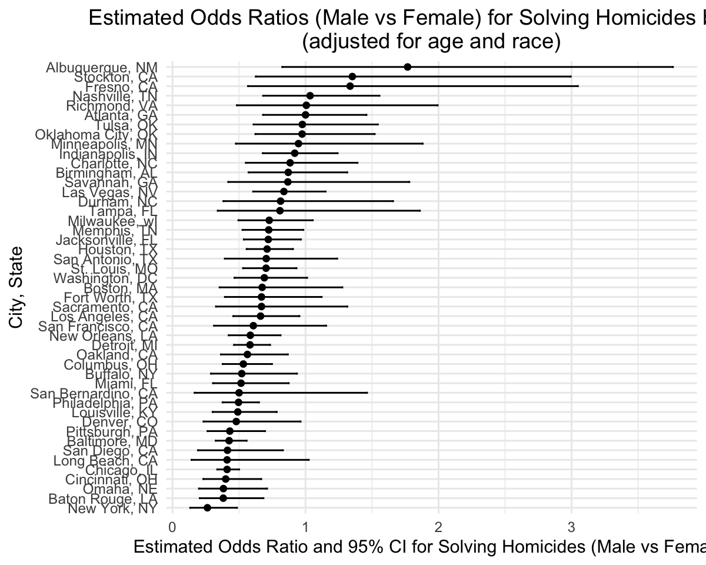
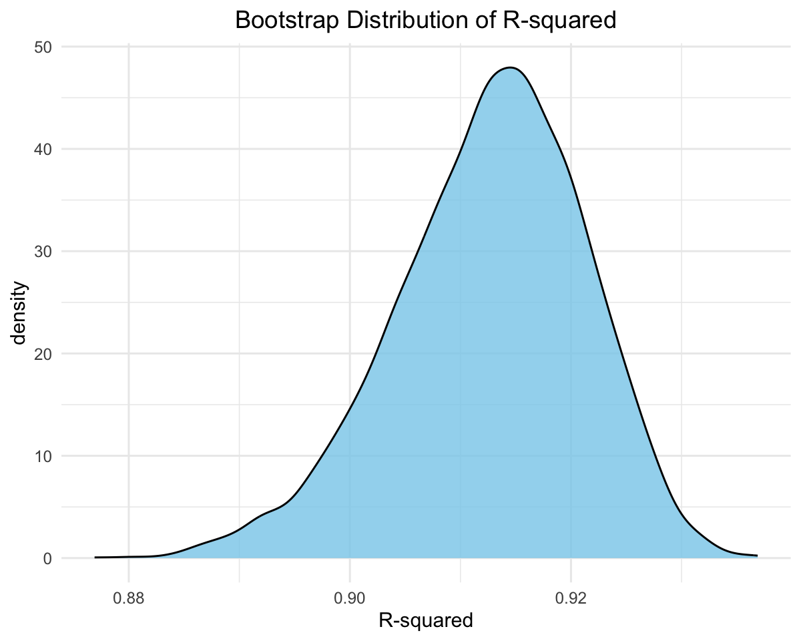
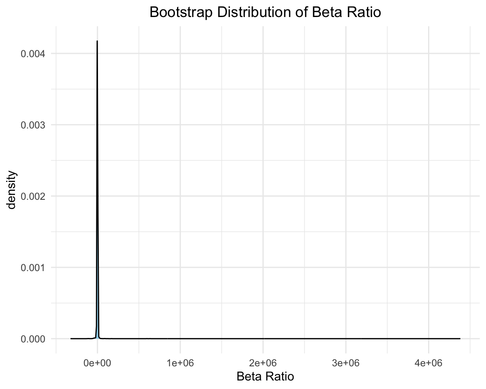
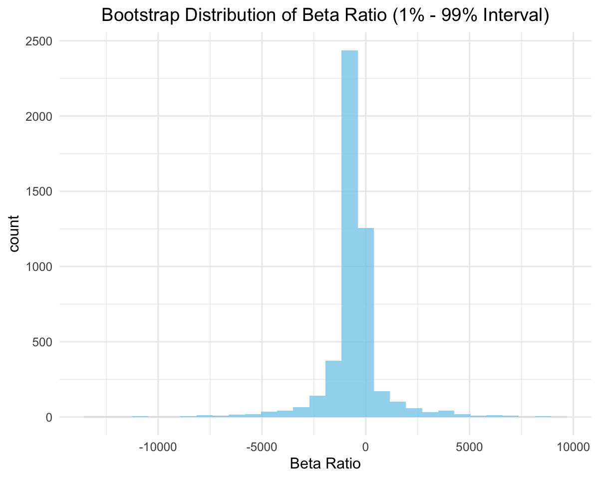
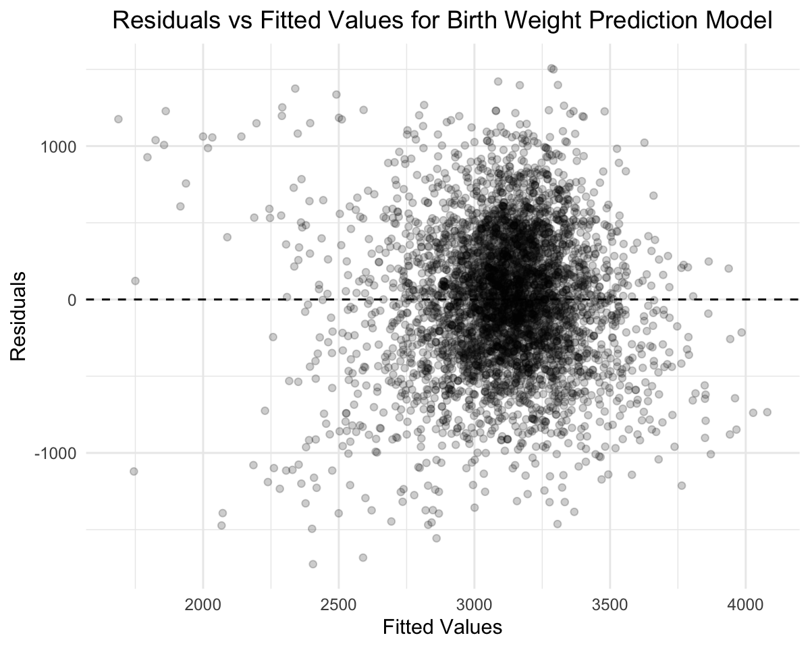
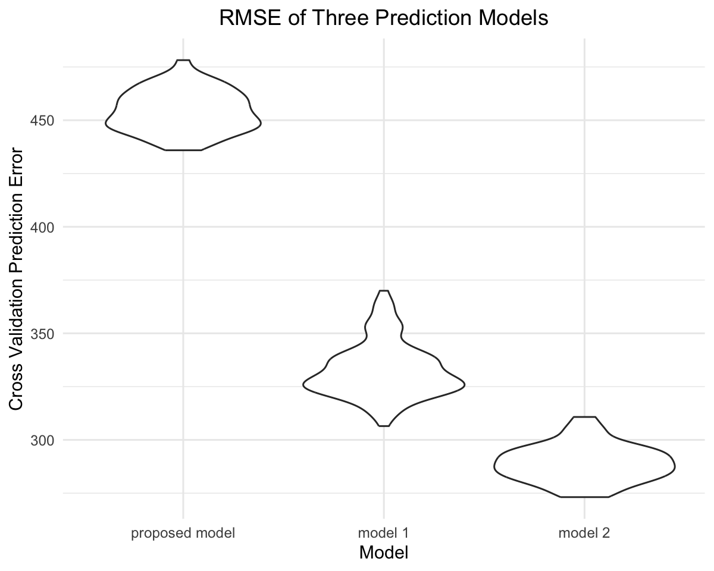

p8105_hw6_xh2601
================

``` r
# load the tidyverse library
library(tidyverse)
library(modelr)
set.seed(1)
```

The general format for plots making

``` r
knitr::opts_chunk$set(
  fig.width = 6,
  fig.asp = .8,
  out.width = "90%",
  dpi = 200
)

theme_set(
  theme_minimal() + 
    theme(legend.position = "bottom",
          plot.title = element_text(hjust = 0.5))
)

options(
  ggplot2.continuous.colour = "viridis",
  ggplot2.continuous.fill = "viridis"
)

scale_colour_discrete = scale_colour_viridis_d
scale_fill_discrete = scale_fill_viridis_d
```

## Problem 1

1.  Create a city_state variable (e.g. “Baltimore, MD”), and a binary
    variable indicating whether the homicide is solved. Omit cities
    Dallas, TX; Phoenix, AZ; and Kansas City, MO – these don’t report
    victim race. Also omit Tulsa, AL – this is a data entry mistake. For
    this problem, limit your analysis those for whom victim_race is
    white or black. Be sure that victim_age is numeric.

``` r
# import the dataset
# use mutate() to create the city_state variable
# use mutate() to create a variable to indicate whether the case is unsolved
# use mutate() to make sure victim_age is numeric
# use filter() remove the unwanted rows
homicide_df = read_csv("data/homicide-data.csv") |> 
  janitor::clean_names() |> 
  mutate(
    city_state = str_c(city, ", ", state),
    solved = (!disposition %in% c("Closed without arrest", "Open/No arrest")),
    victim_age = as.numeric(victim_age)
  ) |> 
  filter(
    !city_state %in% c("Dallas, TX", "Phoenix, AZ", "Kansas City, MO", "Tulsa, AL"),
    victim_race %in% c("White", "Black")
  )
```

    ## Rows: 52179 Columns: 12
    ## ── Column specification ────────────────────────────────────────────────────────
    ## Delimiter: ","
    ## chr (9): uid, victim_last, victim_first, victim_race, victim_age, victim_sex...
    ## dbl (3): reported_date, lat, lon
    ## 
    ## ℹ Use `spec()` to retrieve the full column specification for this data.
    ## ℹ Specify the column types or set `show_col_types = FALSE` to quiet this message.

    ## Warning: There was 1 warning in `mutate()`.
    ## ℹ In argument: `victim_age = as.numeric(victim_age)`.
    ## Caused by warning:
    ## ! NAs introduced by coercion

2.  For the city of Baltimore, MD, use the glm function to fit a
    logistic regression with resolved vs unresolved as the outcome and
    victim age, sex and race as predictors. Save the output of glm as an
    R object; apply the broom::tidy to this object; and obtain the
    estimate and confidence interval of the adjusted odds ratio for
    solving homicides comparing male victims to female victims keeping
    all other variables fixed.

``` r
# create a df for baltimore
# select variables of interest
baltimore_df = homicide_df |> 
  filter(city_state == "Baltimore, MD") |> 
  select(uid, victim_race, victim_age, victim_sex, solved)

# fit glm logistic model 
# apply broom::tidy() and exponentiate the estimate
baltimore_logit = 
  glm(
    solved ~ victim_race + victim_age + victim_sex,
    data = baltimore_df,
    family = binomial(link = "logit")) |> 
  broom::tidy(
    exponentiate = TRUE,
    conf.int = TRUE)

# get odds ration estimate and CI
baltimore_logit |> 
  filter(term == "victim_sexMale") |> 
  select(term, estimate, conf.low, conf.high) |> 
  knitr::kable()
```

| term           |  estimate |  conf.low | conf.high |
|:---------------|----------:|----------:|----------:|
| victim_sexMale | 0.4255117 | 0.3241908 | 0.5575508 |

3.  Now run glm for each of the cities in your dataset, and extract the
    adjusted odds ratio (and CI) for solving homicides comparing male
    victims to female victims. Do this within a “tidy” pipeline, making
    use of purrr::map, list columns, and unnest as necessary to create a
    dataframe with estimated ORs and CIs for each city.

``` r
# create a function to fit logistic regression for each city
homicide_sex_logit = function(df){
  glm(
    solved ~ victim_race + victim_age + victim_sex,
    data = df,
    family = binomial(link = "logit")) |> 
  broom::tidy(
    exponentiate = TRUE,
    conf.int = TRUE) |> 
  filter(term == "victim_sexMale") |> 
  select(term, estimate, conf.low, conf.high)
}
```

``` r
# select the variables of interest, nest on city_state
# map on the homicide_sex_logit() function for each nested dataframe
# unnest the result
homicide_sex = homicide_df |> 
  select(uid, city_state, victim_race, victim_age, victim_sex, solved) |> 
  nest(data = -city_state) |> 
  mutate(
    results = map(data, homicide_sex_logit)
  ) |> 
  select(-data) |> 
  unnest()
```

    ## Warning: There were 43 warnings in `mutate()`.
    ## The first warning was:
    ## ℹ In argument: `results = map(data, homicide_sex_logit)`.
    ## Caused by warning:
    ## ! glm.fit: fitted probabilities numerically 0 or 1 occurred
    ## ℹ Run `dplyr::last_dplyr_warnings()` to see the 42 remaining warnings.

    ## Warning: `cols` is now required when using `unnest()`.
    ## ℹ Please use `cols = c(results)`.

``` r
homicide_sex |> knitr::kable()
```

| city_state         | term           |  estimate |  conf.low | conf.high |
|:-------------------|:---------------|----------:|----------:|----------:|
| Albuquerque, NM    | victim_sexMale | 1.7674995 | 0.8247081 | 3.7618600 |
| Atlanta, GA        | victim_sexMale | 1.0000771 | 0.6803477 | 1.4582575 |
| Baltimore, MD      | victim_sexMale | 0.4255117 | 0.3241908 | 0.5575508 |
| Baton Rouge, LA    | victim_sexMale | 0.3814393 | 0.2043481 | 0.6836343 |
| Birmingham, AL     | victim_sexMale | 0.8700153 | 0.5713814 | 1.3138409 |
| Boston, MA         | victim_sexMale | 0.6739912 | 0.3534469 | 1.2768225 |
| Buffalo, NY        | victim_sexMale | 0.5205704 | 0.2884416 | 0.9358300 |
| Charlotte, NC      | victim_sexMale | 0.8838976 | 0.5507440 | 1.3905954 |
| Chicago, IL        | victim_sexMale | 0.4100982 | 0.3361233 | 0.5008546 |
| Cincinnati, OH     | victim_sexMale | 0.3998277 | 0.2313767 | 0.6670456 |
| Columbus, OH       | victim_sexMale | 0.5324845 | 0.3770457 | 0.7479124 |
| Denver, CO         | victim_sexMale | 0.4790620 | 0.2327380 | 0.9624974 |
| Detroit, MI        | victim_sexMale | 0.5823472 | 0.4619454 | 0.7335458 |
| Durham, NC         | victim_sexMale | 0.8123514 | 0.3824420 | 1.6580169 |
| Fort Worth, TX     | victim_sexMale | 0.6689803 | 0.3935128 | 1.1211603 |
| Fresno, CA         | victim_sexMale | 1.3351647 | 0.5672553 | 3.0475080 |
| Houston, TX        | victim_sexMale | 0.7110264 | 0.5569844 | 0.9057376 |
| Indianapolis, IN   | victim_sexMale | 0.9187284 | 0.6784616 | 1.2413059 |
| Jacksonville, FL   | victim_sexMale | 0.7198144 | 0.5359236 | 0.9650986 |
| Las Vegas, NV      | victim_sexMale | 0.8373078 | 0.6058830 | 1.1510854 |
| Long Beach, CA     | victim_sexMale | 0.4102163 | 0.1427304 | 1.0241775 |
| Los Angeles, CA    | victim_sexMale | 0.6618816 | 0.4565014 | 0.9541036 |
| Louisville, KY     | victim_sexMale | 0.4905546 | 0.3014879 | 0.7836391 |
| Memphis, TN        | victim_sexMale | 0.7232194 | 0.5261210 | 0.9835973 |
| Miami, FL          | victim_sexMale | 0.5152379 | 0.3040214 | 0.8734480 |
| Milwaukee, wI      | victim_sexMale | 0.7271327 | 0.4951325 | 1.0542297 |
| Minneapolis, MN    | victim_sexMale | 0.9469587 | 0.4759016 | 1.8809745 |
| Nashville, TN      | victim_sexMale | 1.0342379 | 0.6807452 | 1.5559966 |
| New Orleans, LA    | victim_sexMale | 0.5849373 | 0.4218807 | 0.8121787 |
| New York, NY       | victim_sexMale | 0.2623978 | 0.1327512 | 0.4850117 |
| Oakland, CA        | victim_sexMale | 0.5630819 | 0.3637421 | 0.8671086 |
| Oklahoma City, OK  | victim_sexMale | 0.9740747 | 0.6228507 | 1.5199721 |
| Omaha, NE          | victim_sexMale | 0.3824861 | 0.1988357 | 0.7109316 |
| Philadelphia, PA   | victim_sexMale | 0.4962756 | 0.3760120 | 0.6498797 |
| Pittsburgh, PA     | victim_sexMale | 0.4307528 | 0.2626022 | 0.6955518 |
| Richmond, VA       | victim_sexMale | 1.0060520 | 0.4834671 | 1.9936248 |
| San Antonio, TX    | victim_sexMale | 0.7046200 | 0.3928179 | 1.2382509 |
| Sacramento, CA     | victim_sexMale | 0.6688418 | 0.3262733 | 1.3143888 |
| Savannah, GA       | victim_sexMale | 0.8669817 | 0.4185827 | 1.7802453 |
| San Bernardino, CA | victim_sexMale | 0.5003444 | 0.1655367 | 1.4623977 |
| San Diego, CA      | victim_sexMale | 0.4130248 | 0.1913527 | 0.8301847 |
| San Francisco, CA  | victim_sexMale | 0.6075362 | 0.3116925 | 1.1551470 |
| St. Louis, MO      | victim_sexMale | 0.7031665 | 0.5298505 | 0.9319005 |
| Stockton, CA       | victim_sexMale | 1.3517273 | 0.6256427 | 2.9941299 |
| Tampa, FL          | victim_sexMale | 0.8077029 | 0.3395253 | 1.8598834 |
| Tulsa, OK          | victim_sexMale | 0.9757694 | 0.6090664 | 1.5439356 |
| Washington, DC     | victim_sexMale | 0.6901713 | 0.4653608 | 1.0122516 |

4.  Create a plot that shows the estimated ORs and CIs for each city.
    Organize cities according to estimated OR, and comment on the plot.

``` r
homicide_sex |> 
  mutate(city_state = fct_reorder(city_state, estimate)) |> 
  ggplot(aes(x = estimate, y = city_state)) +
  geom_point() +
  geom_errorbarh(aes(xmin = conf.low, xmax = conf.high), height = 0.2) +
  labs(
    x = "Estimated Odds Ratio and 95% CI for Solving Homicides (Male vs Female)",
    y = "City, State",
    title = "Estimated Odds Ratios (Male vs Female) for Solving Homicides by City \n(adjusted for age and race)"
  )
```



Based on the plot, most cities have estimated odds ratios below 1,
indicating that homicides involving male victims are less likely to be
solved compared to those involving female victims, after adjusting for
age and race. However, some of these odds ratios are not statistically
significant, as their confidence intervals include 1. Only a few cities
show odds ratios above 1, suggesting male-victim homicides being more
likely to be solved, but none of these estimates are statistically
significant, as their confidence intervals all span 1. Overall, in most
cities, the odds of a homicide being solved are lower for male victims
when compared to female victims, adjusted for age and race, although the
statistical significance varies by city and is often inconclusive due to
wide confidence intervals.

## Problem 2

1.  For this problem, we’ll use the Central Park weather data we’ve seen
    elsewhere. The code chunk below will import these data from the
    p8105.datasets package. We’ll focus on a simple linear regression
    with tmax as the response with tmin and prcp as the predictors, and
    are interested in the distribution of two quantities estimated from
    these data: r_hat square, beta1_hat/beta2_hat

``` r
# load package
library(p8105.datasets)
data("weather_df")
```

``` r
# clean the dataset with CentralPark_NY and variables of interest
weather_df = weather_df |> 
  filter(name == "CentralPark_NY") |> 
  select(tmin, prcp, tmax)
```

2.  Use 5000 bootstrap samples and, for each bootstrap sample, produce
    estimates of these two quantities.

``` r
# create a function to get the beta ratio for beta1 = tmin, beta2 = prcp
get_beta_ratio = function(model) {
  coefs = broom::tidy(model)
  beta1 = coefs$estimate[coefs$term == "tmin"]
  beta2 = coefs$estimate[coefs$term == "prcp"]
  beta1 / beta2
}
```

``` r
# bootstrap for 5000 samples, fit linear model, and get estimates
bootstrap_weather = weather_df |> 
  bootstrap(n = 5000) |> 
  mutate(
    df = map(strap, as_tibble),
    models = map(df, \(df) lm(tmax ~ tmin + prcp, data = df) ),
    r2 = map_dbl(models, \(m) broom::glance(m)$r.squared),
    beta_ratio = map_dbl(models, get_beta_ratio)) |> 
  select(-strap, -models, -df)
bootstrap_weather
```

    ## # A tibble: 5,000 × 3
    ##    .id      r2 beta_ratio
    ##    <chr> <dbl>      <dbl>
    ##  1 0001  0.913      -237.
    ##  2 0002  0.921      -424.
    ##  3 0003  0.905     -1492.
    ##  4 0004  0.921      -364.
    ##  5 0005  0.906      -461.
    ##  6 0006  0.915      -634.
    ##  7 0007  0.919      -808.
    ##  8 0008  0.905     -2435.
    ##  9 0009  0.917      -723.
    ## 10 0010  0.916      -344.
    ## # ℹ 4,990 more rows

3.  Plot the distribution of your estimates, and describe these in
    words.

``` r
# density plot for r^2
bootstrap_weather |> 
  ggplot(aes(x = r2)) +
  geom_density(fill = "skyblue", alpha = 0.8) +
  labs(
    x = "R-squared",
    title = "Bootstrap Distribution of R-squared")
```



The distribution of R-squared in bootstrap samples is unimodal and
approximately symmetric around 0.913, and slightly left skewed. The
distribution means the r_hat square estimates are relatively stable, so
the linear model using tmin and prcp as predictors could explain about
91% of changes in tmax.

``` r
# density plot for beta ratio
bootstrap_weather |> 
  ggplot(aes(x = beta_ratio)) +
  geom_density(fill = "skyblue", alpha = 0.8) +
  labs(
    x = "Beta Ratio",
    title = "Bootstrap Distribution of Beta Ratio")
```



The bootstrap distribution of the beta ratio shows a sharp peak near 0,
with extremely long tails on both sides of the density plot. The
long-tailed shape occurs because precipitation (prcp) takes the value
zero on for more than half of the days in the original dataset, so many
bootstrap samples contain little variation in prcp. In such samples, the
estimated coefficient beta2 for prcp would be very small, causing the
ratio of beta1 / beta2 to explode to extremely large absolute values,
especially on the negative side.

To visualize the central behavior of the ratio, the following histogram
looks at only the middle 98% of the bootstrap distribution (the 1%–99%
interval). Within this trimmed range, the majority of values cluster
around a central peak on a negative ratio, while both tails remain wide.
This reflects instability in the denominator beta2, and the ratio is
hard to be interpreted in this sample.

``` r
# only plot between 1%-99% interval
small_ratio = quantile(bootstrap_weather$beta_ratio, 0.01, na.rm = TRUE)
large_ratio = quantile(bootstrap_weather$beta_ratio, 0.99, na.rm = TRUE)

interval_data = bootstrap_weather |> 
  filter(beta_ratio > small_ratio, beta_ratio < large_ratio)

ggplot(interval_data, aes(beta_ratio)) +
  geom_histogram(fill = "skyblue", alpha = 0.8) +
  labs(
    x = "Beta Ratio",
    title = "Bootstrap Distribution of Beta Ratio (1% - 99% Interval)")
```

    ## `stat_bin()` using `bins = 30`. Pick better value with `binwidth`.



4.  Using the 5000 bootstrap estimates, identify the 2.5% and 97.5%
    quantiles to provide a 95% confidence interval

``` r
# get 95% CI for both 
ci_results = bootstrap_weather |> 
  summarize(
    r2_ci_lower = quantile(r2, 0.025), 
    r2_ci_upper = quantile(r2, 0.975),
    beta_ratio_ci_lower = quantile(beta_ratio, 0.025), 
    beta_ratio_ci_upper = quantile(beta_ratio, 0.975))
ci_results |> knitr::kable()
```

| r2_ci_lower | r2_ci_upper | beta_ratio_ci_lower | beta_ratio_ci_upper |
|------------:|------------:|--------------------:|--------------------:|
|   0.8942062 |   0.9276728 |           -5616.445 |            4586.923 |

The 95% confidence interval for R-squared is 0.8942062 to 0.9276728, the
The 95% confidence interval for beta ratio is -5616.4447381 to
4586.922945.

## Problem 3

1.  Load and clean the data for regression analysis (i.e. use
    appropriate variable names, convert numeric to factor where
    appropriate, check for the presence of missing data, etc.).

``` r
# import data
# convert some variables to factors
birthweight_df = read_csv("data/birthweight.csv") |> 
  janitor::clean_names() |> 
  mutate(
    babysex = factor(babysex,
                     levels = c(1, 2),
                     labels = c("male", "female")),
    frace = factor(frace,
                   levels = c(1, 2, 3, 4, 8, 9),
                   labels = c("White", "Black", "Asian", "Puerto Rican", "Other", "Unknown")),
    malform = factor(malform,
                     levels = c(0, 1),
                     labels = c("absent", "present")),
    mrace = factor(mrace,
                   levels = c(1, 2, 3, 4, 8),
                   labels = c("White", "Black", "Asian", "Puerto Rican", "Other"))
  )
```

    ## Rows: 4342 Columns: 20
    ## ── Column specification ────────────────────────────────────────────────────────
    ## Delimiter: ","
    ## dbl (20): babysex, bhead, blength, bwt, delwt, fincome, frace, gaweeks, malf...
    ## 
    ## ℹ Use `spec()` to retrieve the full column specification for this data.
    ## ℹ Specify the column types or set `show_col_types = FALSE` to quiet this message.

``` r
# check missing data in the dataset
sum(is.na(birthweight_df))
```

    ## [1] 0

2.  Propose a regression model for birthweight. This model may be based
    on a hypothesized structure for the factors that underly
    birthweight, on a data-driven model-building process, or a
    combination of the two. Describe your modeling process and show a
    plot of model residuals against fitted values – use add_predictions
    and add_residuals in making this plot.

**Model building:** Birthweight is influenced by a combination of
maternal physiological characteristics and pregnancy-related
developmental factors. Maternal height and pre-pregnancy weight reflect
long-term nutritional status and genetic influences on fetal growth. In
addition, weight gain during pregnancy and gestational age in weeks are
indicators of the adequacy of fetal development and duration of
intrauterine growth. Consistent with findings reported in the
[literature](https://pmc.ncbi.nlm.nih.gov/articles/PMC11608488/),
maternal height, pre-pregnancy weight, and pregnancy weight gain were
consistently associated with birthweight. Based on these hypothesized
mechanisms and empirical support, I propose a regression model using
maternal pre-pregnancy BMI (**ppbmi**), mother’s weight gain during
pregnancy in pounds (**wtgain**), and gestational age in weeks
(**gaweeks**), as the predictors of baby’s birth weight in grams
(**bwt**).

``` r
# construct my model
bwt_my_model = lm(bwt ~ ppbmi + wtgain + gaweeks, data = birthweight_df)
summary(bwt_my_model)
```

    ## 
    ## Call:
    ## lm(formula = bwt ~ ppbmi + wtgain + gaweeks, data = birthweight_df)
    ## 
    ## Residuals:
    ##      Min       1Q   Median       3Q      Max 
    ## -1724.96  -295.64     3.05   295.40  1507.02 
    ## 
    ## Coefficients:
    ##             Estimate Std. Error t value Pr(>|t|)    
    ## (Intercept) 109.7702    97.2279   1.129    0.259    
    ## ppbmi        17.0382     2.1785   7.821 6.53e-15 ***
    ## wtgain        9.4856     0.6402  14.816  < 2e-16 ***
    ## gaweeks      61.5746     2.2086  27.879  < 2e-16 ***
    ## ---
    ## Signif. codes:  0 '***' 0.001 '**' 0.01 '*' 0.05 '.' 0.1 ' ' 1
    ## 
    ## Residual standard error: 453.5 on 4338 degrees of freedom
    ## Multiple R-squared:  0.2164, Adjusted R-squared:  0.2158 
    ## F-statistic: 399.3 on 3 and 4338 DF,  p-value: < 2.2e-16

The results show that all three predictors have statistically
significant positive associations with birthweight.

``` r
# show a plot of model residuals against fitted values
birthweight_df |> 
  add_residuals(bwt_my_model) |> 
  add_predictions(bwt_my_model) |> 
  ggplot(aes(x = pred, y = resid)) +
  geom_point(alpha = 0.2) +
  geom_hline(yintercept = 0, linetype = "dashed") +
  labs(
    x = "Fitted Values",
    y = "Residuals",
    title = "Residuals vs Fitted Values for Birth Weight Prediction Model"
  )
```



The plot shows that residuals appear to be randomly scattered around 0
with no strong pattern, forming a roughly symmetric cloud.

3.  Compare your model to two others:

One using length at birth and gestational age as predictors (main
effects only)

``` r
# construct model 1
bwt_model1 = lm(bwt ~ blength + gaweeks, data = birthweight_df)
summary(bwt_model1)
```

    ## 
    ## Call:
    ## lm(formula = bwt ~ blength + gaweeks, data = birthweight_df)
    ## 
    ## Residuals:
    ##     Min      1Q  Median      3Q     Max 
    ## -1709.6  -215.4   -11.4   208.2  4188.8 
    ## 
    ## Coefficients:
    ##              Estimate Std. Error t value Pr(>|t|)    
    ## (Intercept) -4347.667     97.958  -44.38   <2e-16 ***
    ## blength       128.556      1.990   64.60   <2e-16 ***
    ## gaweeks        27.047      1.718   15.74   <2e-16 ***
    ## ---
    ## Signif. codes:  0 '***' 0.001 '**' 0.01 '*' 0.05 '.' 0.1 ' ' 1
    ## 
    ## Residual standard error: 333.2 on 4339 degrees of freedom
    ## Multiple R-squared:  0.5769, Adjusted R-squared:  0.5767 
    ## F-statistic:  2958 on 2 and 4339 DF,  p-value: < 2.2e-16

One using head circumference, length, sex, and all interactions
(including the three-way interaction) between these

``` r
# construct model 2
bwt_model2 = lm(bwt ~ bhead + blength + babysex + bhead*blength + bhead*babysex + blength*babysex + bhead*blength*babysex, data = birthweight_df)
summary(bwt_model2)
```

    ## 
    ## Call:
    ## lm(formula = bwt ~ bhead + blength + babysex + bhead * blength + 
    ##     bhead * babysex + blength * babysex + bhead * blength * babysex, 
    ##     data = birthweight_df)
    ## 
    ## Residuals:
    ##      Min       1Q   Median       3Q      Max 
    ## -1132.99  -190.42   -10.33   178.63  2617.96 
    ## 
    ## Coefficients:
    ##                               Estimate Std. Error t value Pr(>|t|)    
    ## (Intercept)                 -7176.8170  1264.8397  -5.674 1.49e-08 ***
    ## bhead                         181.7956    38.0542   4.777 1.84e-06 ***
    ## blength                       102.1269    26.2118   3.896 9.92e-05 ***
    ## babysexfemale                6374.8684  1677.7669   3.800 0.000147 ***
    ## bhead:blength                  -0.5536     0.7802  -0.710 0.478012    
    ## bhead:babysexfemale          -198.3932    51.0917  -3.883 0.000105 ***
    ## blength:babysexfemale        -123.7729    35.1185  -3.524 0.000429 ***
    ## bhead:blength:babysexfemale     3.8781     1.0566   3.670 0.000245 ***
    ## ---
    ## Signif. codes:  0 '***' 0.001 '**' 0.01 '*' 0.05 '.' 0.1 ' ' 1
    ## 
    ## Residual standard error: 287.7 on 4334 degrees of freedom
    ## Multiple R-squared:  0.6849, Adjusted R-squared:  0.6844 
    ## F-statistic:  1346 on 7 and 4334 DF,  p-value: < 2.2e-16

4.  Make this comparison in terms of the cross-validated prediction
    error; use crossv_mc and functions in purrr as appropriate.

``` r
# create functions to construct models
model_bwt = function(df) {
  lm(bwt ~ ppbmi + wtgain + gaweeks, data = df)
}

model_1 = function(df) {
  lm(bwt ~ blength + gaweeks, data = df)
}

model_2 = function(df) {
  lm(bwt ~ bhead + blength + babysex + bhead*blength + bhead*babysex + blength*babysex + bhead*blength*babysex, data = df)
}
```

``` r
# use crossv_mc() for cross validation
# fit all three models for training set
# get rmse for all three fits in testing set
cv_df =
  crossv_mc(birthweight_df, n = 100) |>
  mutate(
    train = map(train, as_tibble),
    test = map(test, as_tibble),
    fit_bwt = map(train, model_bwt),
    fit_1 = map(train, model_1),
    fit_2 = map(train, model_2),
    rmse_bwt = map2_dbl(fit_bwt, test, \(mod, df) rmse(model = mod, data = df)),
    rmse_1 = map2_dbl(fit_1, test, \(mod, df) rmse(model = mod, data = df)),
    rmse_2 = map2_dbl(fit_2, test, \(mod, df) rmse(model = mod, data = df))
  )

# make comparison in plot
cv_df |> 
  select(starts_with("rmse")) |> 
  rename(
    "proposed model" = "rmse_bwt",
    "model 1" = "rmse_1",
    "model 2" = "rmse_2") |> 
  pivot_longer(
    everything(),
    names_to = "model", 
    values_to = "rmse") |> 
  mutate(model = fct_inorder(model)) |>
  ggplot(aes(x = model, y = rmse)) + geom_violin() +
  labs(
    x = "Model",
    y = "Cross Validation Prediction Error",
    title = "RMSE of Three Prediction Models"
  )
```



As shown in the RMSE distributions, Model 2 has the smallest prediction
error, while my proposed model has the largest RMSE. This indicates that
Model 2 provides the most accurate predictions of birth weight among the
three models, suggesting that maternal characteristics alone are less
informative for predicting baby birth weight compared with newborn
measurements and their interactions.
